  

---

  

  

  

    Estudante de Análise e Desenvolvimento de Sistemas na Fatec São Paulo. 
    Ex-Proano em Desenvolvimento Web e Técnico em Desenvolvimento de Sistemas.
  

  

  

---

<h2 align="center">Tech Stack</h2>

| Frontend | Backend | Ferramentas
| :---: | :---: |  :---: |
|   |  |  

<!-- 

   
  
  
  
  
  
  
  
  
  
  
  
  
  

 -->

<h2 align="center">Meus Projetos:</h2>

| Projeto | Proposta | Tech Stack |
| :------ | :-------- | :--------- |
| **[CiberPerifa](https://github.com/ProjetoIntegradorCiberseguranca)** | Programa em desenvolvimento criado para a disciplina de Projeto Integrador do 1º semestre da **FATEC São Paulo**, em 2026. O projeto tem como objetivo conscientizar usuários sobre a relevância do tema de Ciberseguranca no meio digital, através de um documento acessível para download e atualizado periodicamente  com dados sobre a quantidade de novos casos de falhas e problemas relacionados ao tema. | `HTML` `CSS` `JavaScript` `Python` `Figma` |
| **[Argus Vision](https://github.com/orgs/ArgusVision-demoday/repositories)** | Projeto desenvolvido para o **Demo Day do Instituto PROA**, no primeiro semestre de 2026. Consiste em uma solução de tecnologia assistiva voltada para pessoas com deficiência visual, utilizando uma coleira inteligente com rastreador GPS e sensores de obstáculos para oferecer mais autonomia, segurança e inclusão durante passeios com cães-guia. | `HTML` `CSS` `JavaScript` `C#` `Groq` `SQL Server` `Figma` |
| **[Litera](https://github.com/MarleyS439/litera)** | Suíte de jogos educacionais desenvolvida como Trabalho de Conclusão de Curso da **ETEC de Guaianazes** em 2024. O projeto tem como objetivo auxiliar crianças brasileiras no processo de alfabetização através de jogos interativos, tornando o aprendizado mais acessível, divertido e envolvente. | `HTML` `CSS` `JavaScript` `PHP` `Java` `JQuery` `MySQL` `Figma` |

<h2 align="center">Estatísticas:</h2>

  
  

  

